# CLARISSA: A Conversational Agent Architecture for Democratizing Reservoir Simulation

**SPE Europe Energy Conference 2026**  
**Technical Category:** Digitalization / Reservoir Simulation  

---

## Abstract

Reservoir simulation remains underutilized across the full spectrum of reservoir engineering—field development planning, production surveillance, forecasting, reserves booking, and exploration risking—despite decades of software advancement. The barrier is not computational; modern solvers are fast and robust. The barrier is accessibility. Graphical user interfaces, designed to simplify simulation, have shifted complexity from keyword syntax to labyrinthine menus. Subject matter experts bypass these interfaces entirely, writing decks in text editors as they have for decades. Meanwhile, practicing reservoir engineers—those who optimize producing assets, justify infill drilling, and defend reserves estimates—cannot readily access simulation because the tooling demands specialist knowledge they lack time to acquire. Even when validated models exist, they remain underutilized: engineers receive a handful of sensitivities from simulation specialists rather than exploring the decision space themselves.

This paper introduces CLARISSA (Conversational Language Agent for Reservoir Integrated Simulation System Analysis), a phased AI agent architecture that replaces the GUI paradigm with physics-aware conversational interaction. Rather than requiring users to navigate software, CLARISSA enables reservoir engineers to build and iterate on simulation models through natural language dialogue.

Recent work has demonstrated generative AI assistants that help engineers query existing models and retrieve simulator documentation (SPE-221987). CLARISSA addresses a different problem: generating complete, validated input decks from natural language specifications while maintaining simulator-in-the-loop feedback for physics-grounded reasoning. The architecture combines large language models for planning and human interaction, reinforcement learning for optimizing action sequences based on numerical outcomes such as convergence behavior, and neuro-symbolic components enforcing engineering constraints and safety boundaries.

CLARISSA integrates OPM Flow as primary execution backend, enabling a web-based service model accessible to operators without commercial simulation licenses. When third-party validation is required, Eclipse-format decks can be exported for execution on industry-standard platforms. Physics-aware validation during conversational elicitation flags inconsistencies before simulation; for incomplete specifications, the system suggests defaults informed by analog databases, explicitly documenting assumptions for engineering review.

To enable systematic evaluation, we introduce RIGOR (Reservoir Input Generation Output Review), a benchmark framework assessing deck generation across four dimensions: syntactic validity, semantic correctness, physical plausibility, and conversational efficiency. RIGOR defines complexity tiers from foundational single-well models through pattern floods to multi-phase compositional scenarios.

CLARISSA evolves through three phases: syntactic assistance for deck generation and debugging, physics-informed support incorporating simulation feedback loops, and ultimately field-specialized agents embedded in operational teams. This paper presents the architectural foundations and Phase I implementation targeting syntactic deck generation with validation.

The binding constraint on simulation adoption has never been solver performance. It is human cognitive load and workflow friction. CLARISSA addresses that constraint directly.

---

## Architecture Overview

---

## Phased Evolution

---

## Comparison: Envoy (SPE-221987) vs CLARISSA

---

## RIGOR Benchmark Framework

```mermaid
flowchart TB
    subgraph DIMS["Evaluation Dimensions"]
        D1[🔤 Syntactic Validity]
        D2[📐 Semantic Correctness]
        D3[⚛️ Physical Plausibility]
        D4[💬 Conversational Efficiency]
    end

    subgraph TIERS["Complexity Tiers"]
        direction LR
        T1[Tier 1<br/>Single-Well<br/>Linear Flow]
        T2[Tier 2<br/>Pattern Flood<br/>Multi-Well]
        T3[Tier 3<br/>Multi-Phase<br/>Compositional]
    end

    D1 --> TIERS
    D2 --> TIERS
    D3 --> TIERS
    D4 --> TIERS

    T1 -->|progression| T2
    T2 -->|progression| T3
```

---

## Conversation Flow Example

```mermaid
sequenceDiagram
    participant E as Engineer
    participant C as CLARISSA
    participant V as Validator
    participant S as OPM Flow

    E->>C: "I need a waterflood model,<br/>5-spot pattern, 40 acre spacing"
    C->>C: Parse intent, identify gaps
    C->>E: "What's the reservoir depth<br/>and initial pressure?"
    E->>C: "8,500 ft TVD, 3,800 psi"
    C->>V: Validate physics constraints
    V-->>C: ✓ Pressure gradient plausible
    C->>C: Generate ECLIPSE deck
    C->>E: "I've assumed 200 md permeability<br/>based on analogous formations.<br/>Confirm or adjust?"
    E->>C: "Use 150 md"
    C->>S: Execute simulation
    S-->>C: Results + convergence data
    C->>E: "Simulation complete.<br/>Water breakthrough at 18 months.<br/>Want sensitivity on spacing?"
```

---

## Technical Stack

---

## Key Differentiators Summary

| Aspect | Envoy (SPE-221987) | CLARISSA |
|--------|-------------------|----------|
| **Primary Function** | Query existing models | Generate complete decks |
| **Interaction Mode** | Q&A on loaded model | Elicitation dialogue |
| **Simulator** | ECHELON (proprietary) | OPM Flow (open source) |
| **Architecture** | RAG + Callback Agents | RL + Neuro-symbolic + Loop |
| **Learning** | Static knowledge bases | Adaptive via sim feedback |
| **Availability** | Commercial license | Web-based, license-free |
| **Validation** | Post-hoc analysis | Pre-execution physics check |

---

## Notes for Authors

- Diagrams are for supplementary material / full paper / presentation
- Abstract submission typically text-only (verify SPE Europe guidelines)
- Mermaid renders in GitLab, GitHub, MkDocs, and most modern Markdown viewers
- For PDF export: use `mermaid-cli` or Pandoc with mermaid filter