# CLARISSA: A Conversational User Interface for Democratizing Reservoir Simulation

**SPE Europe Energy Conference 2026**  
**Category:** 05 Digital Transformation and Artificial Intelligence  
**Subcategory:** 05.6 Use of Machine Learning and AI in Subsurface Operations and Reservoir Optimization

---

**Authors:**  
- Douglas Perschke, Stone Ridge Technology, USA  
- Michal Matejka, Independent Consultant, Houston, USA  
- Wolfram Laube, Independent Researcher, Austria  

---

## Abstract

Reservoir simulation remains underutilized across the full spectrum of reservoir engineering—field development planning, production surveillance, forecasting, reserves booking, and exploration risking—despite decades of software advancement. The barrier is not computational; modern solvers are fast and robust. The barrier is accessibility. Graphical user interfaces (GUIs), designed to simplify simulation, have instead shifted complexity from keyword syntax to labyrinthine menus and forms. Subject matter experts bypass these interfaces entirely, writing decks directly in text editors as they have for decades. Meanwhile, practicing reservoir engineers—those who optimize producing assets, justify infill drilling, and defend reserves estimates—cannot readily access simulation because the tooling demands specialist knowledge they lack time to acquire. Even when validated models exist, they remain underutilized: engineers receive a handful of sensitivities from simulation specialists rather than fully exploring the decision space themselves. The result is over-reliance on type well profiles, analytical methods, and material balance calculations for decisions that warrant rigorous flow modeling.

This paper introduces **CLARISSA** (Conversational Language Agent for Reservoir Integrated Simulation System Analysis), which replaces the GUI paradigm with a Conversational User Interface (CUI). Rather than requiring users to navigate software, CLARISSA enables reservoir engineers to build and iterate on simulation models through natural language dialogue. The system elicits necessary inputs conversationally, translating engineering intent directly into executable simulation decks.

Recent work has demonstrated generative AI assistants that help engineers query existing models and retrieve simulator documentation (SPE-221987). CLARISSA addresses a different problem: generating complete, validated input decks from natural language specifications. Given a verbal description of a reservoir problem, CLARISSA produces a syntactically correct, physically plausible simulation deck ready for execution. The architecture combines large language models for planning and human interaction, reinforcement learning for optimizing action sequences based on numerical outcomes such as convergence behavior, and neuro-symbolic components enforcing engineering constraints and safety boundaries.

CLARISSA generates Eclipse-format decks and executes simulations using OPM Flow, enabling a web-based service model accessible to operators without commercial simulation licenses. When third-party validation is required, decks can be exported for execution on industry-standard commercial platforms. Physics-aware validation during conversational elicitation flags inconsistencies before the simulator is invoked. For incomplete specifications, the system suggests reasonable defaults informed by analog databases, explicitly documenting assumptions for engineering review.

To enable systematic evaluation of CUI-based simulation systems, we introduce **RIGOR** (Reservoir Input Generation Output Review), a benchmark framework assessing deck generation across four dimensions: syntactic validity, semantic correctness, physical plausibility, and conversational efficiency. RIGOR defines complexity tiers from foundational to advanced: a simple linear displacement model representing a laboratory coreflood, progressing through pattern floods with multi-well configurations, to mid-conversation conversion of a black-oil waterflood into a compositional equation-of-state model for tertiary recovery evaluation.

The binding constraint on simulation adoption has never been solver performance. It is human cognitive load and workflow friction. CLARISSA addresses that constraint directly.

---

## 1. Objectives and Scope

### 1.1 Problem Statement

The petroleum industry faces a persistent paradox: while reservoir simulation technology has matured significantly over four decades, its adoption remains confined to a small fraction of decisions that would benefit from rigorous flow modeling. Industry surveys consistently show that fewer than 20% of producing assets have active simulation models, and among those that do, model updates often lag operational reality by months or years (Holdaway, 2014). This underutilization stems not from computational limitations—modern GPU-accelerated simulators can execute million-cell models in minutes—but from the human interface bottleneck.

Current simulation workflows require engineers to master domain-specific input languages comprising hundreds of keywords, each with precise syntax requirements and complex interdependencies. The ECLIPSE keyword manual alone spans over 3,000 pages (Schlumberger, 2020). Training a competent simulation engineer typically requires 2-3 years of dedicated practice. This expertise concentration creates organizational bottlenecks where simulation specialists become gatekeepers, processing requests from asset teams who lack direct access to modeling capabilities.

### 1.2 Research Objectives

This paper addresses three primary objectives:

**Objective 1: Democratize Simulation Access.** Develop a conversational interface that enables reservoir engineers without specialized simulation training to construct and execute physics-based flow models through natural language dialogue.

**Objective 2: Establish Evaluation Standards.** Introduce a systematic benchmark framework (RIGOR) for assessing conversational simulation systems across syntactic, semantic, physical, and efficiency dimensions.

**Objective 3: Enable License-Free Deployment.** Integrate open-source simulation backends (OPM Flow) to remove commercial licensing barriers that restrict simulation access for smaller operators and academic institutions.

### 1.3 Scope and Limitations

CLARISSA's current implementation focuses on black-oil and compositional reservoir models with standard well configurations. The system generates Eclipse-format input decks compatible with both OPM Flow and commercial simulators. Thermal recovery processes, chemical EOR, and coupled geomechanical simulations are planned for future development phases but fall outside the present scope.

The conversational interface supports English-language input; multilingual capabilities represent a future enhancement opportunity. Voice input functionality, while architecturally supported, remains in prototype status pending field validation studies.

---

## 2. Methods, Procedures, Process

### 2.1 System Architecture

The CLARISSA architecture comprises six primary layers, each addressing distinct concerns while maintaining loose coupling through well-defined interfaces:

**User Interface Layer:** Supports multiple interaction modalities—voice input for hands-free operation in field environments, text chat for detailed technical discussions, web interfaces for visual feedback and result exploration, and REST APIs for programmatic integration with existing workflow systems.

**Translation Layer:** Converts natural language input to structured intent representations through a multi-stage pipeline. The confidence scorer assigns probability estimates to parsed interpretations; scores below configurable thresholds trigger clarification requests rather than proceeding with uncertain interpretations. Failed validation at any stage triggers automatic rollback to the previous valid state, preventing error propagation.

**Knowledge Layer:** Maintains three distinct knowledge stores: a vector database containing embedded simulator documentation and keyword references, a corrections database capturing user feedback for continuous improvement, and an analog database providing basin-specific default values for incomplete specifications.

**Core Processing Layer:** Combines LLM-based reasoning for natural language understanding and response generation, reinforcement learning agents for optimizing multi-step action sequences based on simulation outcomes, and neuro-symbolic constraint systems ensuring generated decks satisfy physical laws and engineering safety boundaries.

**Validation Layer:** Implements multi-stage validation ensuring syntactic correctness (keyword spelling, record formats), semantic consistency (referenced entities exist, units compatible), and physical plausibility (pressures within formation limits, saturations sum to unity) before simulation execution.

**Generation Layer:** Produces Eclipse-format decks using template engines populated with validated parameters. The default suggester proposes values for unspecified parameters based on analog matching, with explicit documentation of all assumptions for engineering review.

**Simulation Layer:** Executes generated decks via OPM Flow for open-source accessibility. Export functionality produces decks compatible with commercial platforms when third-party validation is required. The result parser extracts key metrics and convergence diagnostics for feedback to the core processing layer.

### 2.2 Phased Development Approach

CLARISSA development follows a three-phase roadmap, with each phase building capabilities validated in the previous stage:

**Phase I (Current):** Establishes foundational capabilities for generating syntactically valid simulation decks from natural language specifications. Validation focuses on keyword correctness and structural completeness. OPM Flow integration enables immediate execution without commercial licenses.

**Phase II (Next):** Introduces simulator-in-the-loop learning where the RL agent receives feedback from actual simulation runs. Convergence failures, timestep cuts, and numerical warnings inform policy updates. Analog databases provide physics-informed defaults when user specifications are incomplete.

**Phase III (Future):** Deploys CLARISSA as embedded agents within operational workflows—monitoring production data, triggering model updates when surveillance indicates drift from predictions, and supporting multi-user collaboration on shared reservoir models.

### 2.3 Comparison with Prior Work

Recent work by Wiegand et al. (2024) demonstrated Envoy, a generative AI assistant for reservoir simulation built on RAG (Retrieval-Augmented Generation) architecture. Envoy enables engineers to query existing models and retrieve simulator documentation through conversational interaction. CLARISSA extends this paradigm from query-only assistance to complete deck generation:

| Aspect | Envoy (SPE-221987) | CLARISSA |
|--------|-------------------|----------|
| **Primary Function** | Query existing models | Generate complete decks |
| **Interaction Mode** | Q&A on loaded model | Conversational elicitation |
| **Input Modalities** | Text chat | Voice, Text, Web, API |
| **Simulator Backend** | ECHELON (proprietary) | OPM Flow (open source) |
| **AI Architecture** | RAG + Callback Agents | RL + Neuro-symbolic + Feedback |
| **Knowledge Updates** | Static knowledge bases | Adaptive via simulation feedback |
| **Validation Timing** | Post-hoc analysis | Pre-execution physics check |
| **Error Recovery** | Manual correction | Automatic rollback + clarification |
| **Deployment Model** | Commercial license | Web-based, license-free |

### 2.4 Technical Implementation

The CLARISSA prototype implementation leverages established open-source components where available:

The frontend layer provides a React-based web interface with WebSocket support for streaming responses, OpenAI Whisper integration for voice transcription, and FastAPI endpoints for programmatic access. The core layer combines frontier LLMs (Claude, GPT-4) for natural language processing with Proximal Policy Optimization (PPO) agents for action sequence learning and Z3/Prolog constraint solvers for physics boundary enforcement. The backend layer centers on OPM Flow for simulation execution, with PostgreSQL/pgvector providing vector similarity search over embedded documentation.

---

## 3. Results, Observations, Conclusions

### 3.1 RIGOR Benchmark Framework

To enable systematic evaluation of conversational simulation systems, we introduce RIGOR (Reservoir Input Generation Output Review), a benchmark framework assessing performance across four dimensions:

```mermaid
flowchart TB
    subgraph DIMS["Evaluation Dimensions"]
        D1["📝 Syntactic Validity<br/>Parser acceptance,<br/>keyword correctness"]
        D2["🔗 Semantic Correctness<br/>Logical consistency,<br/>unit coherence"]
        D3["⚖️ Physical Plausibility<br/>Pressure gradients,<br/>saturations, rates"]
        D4["💬 Conversational Efficiency<br/>Turns to completion,<br/>clarification rate"]
    end

    subgraph TIERS["Complexity Tiers"]
        T1["Tier 1: Foundational<br/>Linear displacement<br/>Laboratory coreflood<br/>Single-phase flow"]
        T2["Tier 2: Intermediate<br/>Pattern flood<br/>5-spot, 40-acre spacing<br/>Multi-well black-oil"]
        T3["Tier 3: Advanced<br/>Mid-conversation pivot<br/>Black-oil → Compositional<br/>EOS tertiary recovery"]
    end

    D1 --- TIERS
    D2 --- TIERS
    D3 --- TIERS
    D4 --- TIERS
    T1 -->|progression| T2
    T2 -->|progression| T3
```

**Syntactic Validity:** Measures whether generated decks parse without errors. Metrics include keyword recognition rate, record format compliance, and include-file resolution.

**Semantic Correctness:** Assesses logical consistency—do referenced wells exist in WELSPECS, do COMPDAT entries reference valid grid blocks, are fluid properties defined before use?

**Physical Plausibility:** Evaluates whether specified parameters fall within physically reasonable ranges. Pressure gradients should not exceed fracture limits; saturations must sum to unity; production rates should align with well productivity expectations.

**Conversational Efficiency:** Measures the interaction overhead required to achieve a complete, valid deck. Metrics include turns to completion, clarification request frequency, and user correction rate.

### 3.2 Example Interaction Workflow

The following sequence diagram illustrates a typical CLARISSA interaction for generating a waterflood pattern model:

```mermaid
sequenceDiagram
    participant E as 👷 Field Engineer
    participant C as 🤖 CLARISSA
    participant V as ✓ Validator
    participant S as ⚙️ OPM Flow

    Note over E: Voice input from field tablet
    E->>C: I need a waterflood model,<br/>5-spot pattern, 40 acre spacing
    C->>C: Parse intent (confidence: 0.92)
    C->>E: What's the reservoir depth<br/>and initial pressure?
    E->>C: 8,500 ft TVD, about 3,800 psi
    C->>V: Validate pressure gradient
    V-->>C: ✓ 0.45 psi/ft plausible
    C->>C: Generate ECLIPSE deck
    C->>E: I've assumed 200 md permeability<br/>from Permian Basin analogs.<br/>Confirm or override?
    E->>C: Use 150 md, we have core data
    Note over C: Update deck, log assumption override
    C->>S: Execute simulation
    S-->>C: Results + convergence data
    C->>E: Simulation complete in 47 seconds.<br/>Water breakthrough at 18 months.<br/>Want to run spacing sensitivities?
    E->>C: Yes, try 20 and 80 acres
    C->>C: Queue sensitivity runs
```

This interaction demonstrates several key capabilities: voice-initiated requests from field environments, confidence-based clarification triggering, analog-informed default suggestion with explicit documentation, user override capture, and proactive sensitivity analysis offers.

### 3.3 Key Capabilities Demonstrated

**Voice-First Field Operation:** Engineers can interact with CLARISSA from field tablets without keyboard input, enabling simulation access during well site visits, drilling operations, and production surveillance rounds. This mobility removes the office-bound constraint that limits simulation's operational relevance.

**Analog-Informed Defaults:** When specifications are incomplete, CLARISSA queries basin-specific analog databases to suggest reasonable defaults. Critically, all assumptions are explicitly documented in the generated deck comments and conversation log, maintaining full auditability for regulatory and peer-review purposes.

**Graceful Degradation:** Low-confidence interpretations trigger clarification requests rather than incorrect deck generation. Failed validations automatically roll back to the last valid state, preventing error propagation. Users always have visibility into system confidence levels.

**Mid-Conversation Model Evolution:** RIGOR Tier 3 benchmarks demonstrate the ability to pivot a black-oil waterflood model to a compositional equation-of-state representation for tertiary recovery evaluation—within a single conversation session. This flexibility supports the exploratory nature of reservoir engineering workflows.

**License-Free Execution:** OPM Flow integration enables operators without commercial simulation licenses to run rigorous physics-based flow models. This democratization particularly benefits smaller independent operators, national oil companies in developing regions, and academic institutions with limited software budgets.

---

## 4. Novelty and Contribution

The binding constraint on simulation adoption has never been solver performance. It is human cognitive load and workflow friction. CLARISSA addresses that constraint directly through five novel contributions:

**Paradigm Shift from Query to Generation:** While prior work (SPE-221987) demonstrated conversational interfaces for querying existing models, CLARISSA represents the first system capable of generating complete, validated simulation decks from natural language specifications. This shifts the interface paradigm from passive information retrieval to active model construction.

**Multi-Modal Accessibility:** Voice input capability enables field-based simulation workflows that were previously impossible. Engineers can initiate and iterate on models during well site visits, completion operations, and production troubleshooting—contexts where keyboard-based interfaces are impractical.

**Open-Source Simulation Backend:** OPM Flow integration removes commercial licensing barriers that have historically restricted simulation access. Operators can deploy CLARISSA without per-seat license costs, democratizing access for organizations previously excluded from rigorous flow modeling.

**Systematic Evaluation Framework:** RIGOR provides the first standardized benchmark for assessing conversational simulation systems. The four-dimension, three-tier structure enables reproducible comparisons across different system implementations and tracking of capability improvements over time.

**Hybrid AI Architecture:** The combination of LLM reasoning for natural language understanding, reinforcement learning for action sequence optimization, and neuro-symbolic constraints for physics enforcement represents a novel architecture balancing flexibility with engineering-grade reliability requirements.

---

## 5. Future Work

Several extensions are planned for subsequent development phases:

**Thermal and Chemical Processes:** Extend deck generation capabilities to thermal recovery (SAGD, CSS) and chemical EOR (polymer, surfactant, ASP) processes, requiring additional validation rules for temperature-dependent properties and chemical reaction kinetics.

**History Matching Integration:** Connect CLARISSA's conversational interface to automated history matching workflows, enabling engineers to verbally specify match targets and constraints while optimization algorithms adjust model parameters.

**Multi-User Collaboration:** Develop shared workspace capabilities where multiple engineers can collaboratively build and refine models through parallel conversation streams, with conflict resolution for competing parameter specifications.

**Multilingual Support:** Extend natural language processing to support non-English languages, particularly Spanish, Portuguese, Arabic, and Mandarin, reflecting the global distribution of petroleum operations.

---

## Acknowledgments

The authors thank the Open Porous Media Initiative for developing and maintaining OPM Flow as an open-source simulation platform. We also acknowledge the broader open-source AI community whose foundational work on large language models and reinforcement learning enables applications like CLARISSA.

---

## References

1. K. Wiegand, M. Bedewi, K. Mukundakrishnan, D. Tishechkin, V. Ananthan, and D. Kahn, "Using Generative AI to Build a Reservoir Simulation Assistant," SPE-221987-MS, ADIPEC, Abu Dhabi, UAE, November 2024.

2. Open Porous Media Initiative, "OPM Flow Reference Manual," https://opm-project.org, 2024.

3. Schlumberger, "ECLIPSE Reference Manual," 2020.

4. K.H. Coats, "Reservoir Simulation: State of the Art," Journal of Petroleum Technology, vol. 34, no. 8, pp. 1633-1642, August 1982.

5. K.K. Holdaway, "Harness Oil and Gas Big Data with Analytics," Wiley, 2014.

6. A. Vaswani et al., "Attention Is All You Need," Advances in Neural Information Processing Systems, vol. 30, 2017.

7. J. Schulman, F. Wolski, P. Dhariwal, A. Radford, and O. Klimov, "Proximal Policy Optimization Algorithms," arXiv:1707.06347, 2017.

8. P. Lewis et al., "Retrieval-Augmented Generation for Knowledge-Intensive NLP Tasks," Advances in Neural Information Processing Systems, vol. 33, 2020.

9. L. De Moura and N. Bjørner, "Z3: An Efficient SMT Solver," International Conference on Tools and Algorithms for the Construction and Analysis of Systems, pp. 337-340, 2008.

10. T. Brown et al., "Language Models are Few-Shot Learners," Advances in Neural Information Processing Systems, vol. 33, 2020.

---

*Prepared for SPE Europe Energy Conference 2026*
