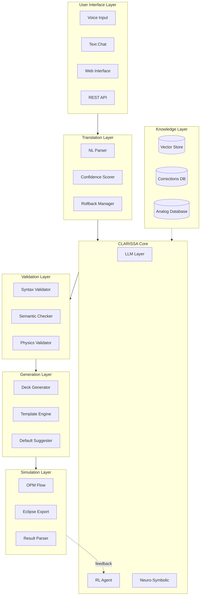
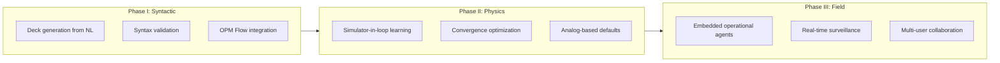
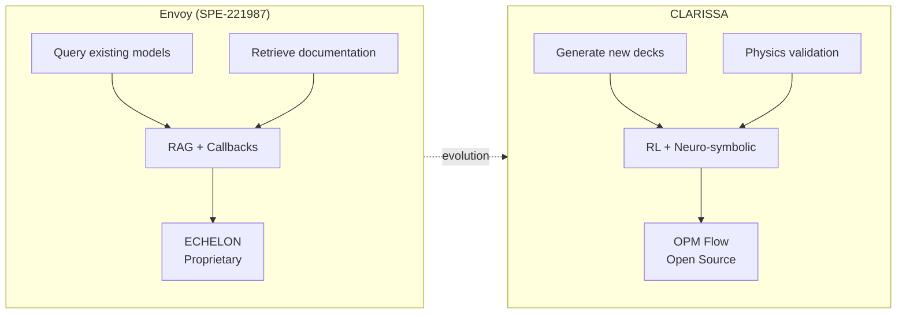
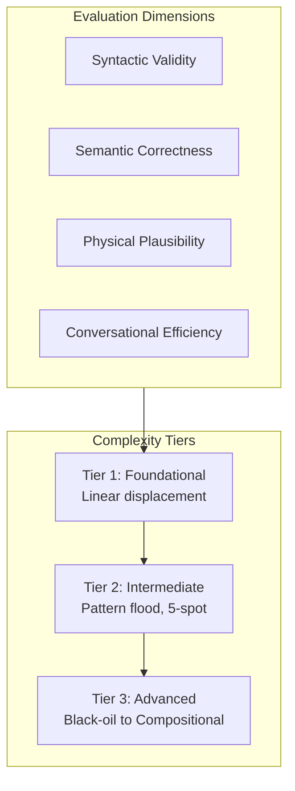
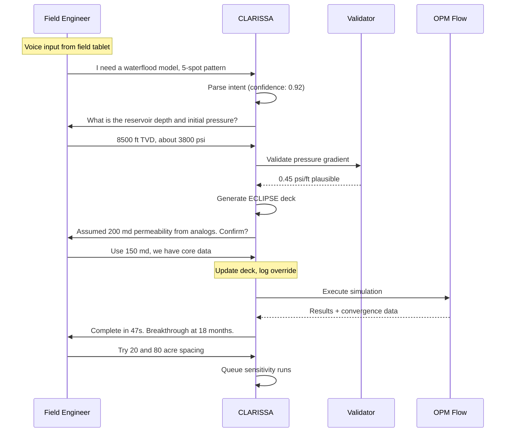

# CLARISSA: A Conversational User Interface for Democratizing Reservoir Simulation

**SPE Europe Energy Conference 2026**  
**Category:** 05 Digital Transformation and Artificial Intelligence  
**Subcategory:** 05.6 Use of Machine Learning and AI in Subsurface Operations and Reservoir Optimization

---

**Authors:**  
- Douglas Perschke, Stone Ridge Technology, USA  
- Michal Matejka, Independent Consultant, Houston, USA  
- Wolfram Laube, Independent Researcher, Austria  

---

## Abstract

Reservoir simulation remains underutilized across the full spectrum of reservoir engineering—field development planning, production surveillance, forecasting, reserves booking, and exploration risking—despite decades of software advancement. The barrier is not computational; modern solvers are fast and robust. The barrier is accessibility. Graphical user interfaces (GUIs), designed to simplify simulation, have instead shifted complexity from keyword syntax to labyrinthine menus and forms. Subject matter experts bypass these interfaces entirely, writing decks directly in text editors as they have for decades. Meanwhile, practicing reservoir engineers—those who optimize producing assets, justify infill drilling, and defend reserves estimates—cannot readily access simulation because the tooling demands specialist knowledge they lack time to acquire. Even when validated models exist, they remain underutilized: engineers receive a handful of sensitivities from simulation specialists rather than fully exploring the decision space themselves. The result is over-reliance on type well profiles, analytical methods, and material balance calculations for decisions that warrant rigorous flow modeling.

This paper introduces **CLARISSA** (Conversational Language Agent for Reservoir Integrated Simulation System Analysis), which replaces the GUI paradigm with a Conversational User Interface (CUI). Rather than requiring users to navigate software, CLARISSA enables reservoir engineers to build and iterate on simulation models through natural language dialogue. The system elicits necessary inputs conversationally, translating engineering intent directly into executable simulation decks.

Recent work has demonstrated generative AI assistants that help engineers query existing models and retrieve simulator documentation (SPE-221987). CLARISSA addresses a different problem: generating complete, validated input decks from natural language specifications. Given a verbal description of a reservoir problem, CLARISSA produces a syntactically correct, physically plausible simulation deck ready for execution. The architecture combines large language models for planning and human interaction, reinforcement learning for optimizing action sequences based on numerical outcomes such as convergence behavior, and neuro-symbolic components enforcing engineering constraints and safety boundaries.

CLARISSA generates Eclipse-format decks and executes simulations using OPM Flow, enabling a web-based service model accessible to operators without commercial simulation licenses. When third-party validation is required, decks can be exported for execution on industry-standard commercial platforms. Physics-aware validation during conversational elicitation flags inconsistencies before the simulator is invoked. For incomplete specifications, the system suggests reasonable defaults informed by analog databases, explicitly documenting assumptions for engineering review.

To enable systematic evaluation of CUI-based simulation systems, we introduce **RIGOR** (Reservoir Input Generation Output Review), a benchmark framework assessing deck generation across four dimensions: syntactic validity, semantic correctness, physical plausibility, and conversational efficiency. RIGOR defines complexity tiers from foundational to advanced: a simple linear displacement model representing a laboratory coreflood, progressing through pattern floods with multi-well configurations, to mid-conversation conversion of a black-oil waterflood into a compositional equation-of-state model for tertiary recovery evaluation.

The binding constraint on simulation adoption has never been solver performance. It is human cognitive load and workflow friction. CLARISSA addresses that constraint directly.

---

## 1. Objectives and Scope

This paper introduces CLARISSA, which replaces the GUI paradigm with a Conversational User Interface (CUI) powered by large language models. Rather than requiring users to navigate software, CLARISSA enables reservoir engineers to build and iterate on simulation models through natural language dialogue. The system elicits necessary inputs conversationally, translating engineering intent directly into executable simulation decks. To enable systematic evaluation of CUI-based simulation systems, we introduce RIGOR, a benchmark framework assessing deck generation across four dimensions: syntactic validity, semantic correctness, physical plausibility, and conversational efficiency.

---

## 2. Methods, Procedures, Process

### 2.1 System Architecture

The CLARISSA architecture comprises six primary layers, each addressing distinct concerns while maintaining loose coupling through well-defined interfaces:

**User Interface Layer:** Supports multiple interaction modalities—voice input for hands-free operation in field environments, text chat for detailed technical discussions, web interfaces for visual feedback and result exploration, and REST APIs for programmatic integration.

**Translation Layer:** Converts natural language input to valid ECLIPSE deck syntax through a multi-stage pipeline. Failed validation at any stage triggers rollback to the previous valid state. Low confidence scores prompt clarification requests rather than proceeding with uncertain interpretations.

**Core Processing Layer:** Combines LLM-based reasoning with reinforcement learning for action optimization and neuro-symbolic constraints for engineering governance.

**Validation Layer:** Multi-stage validation ensuring syntactic correctness, semantic consistency, and physical plausibility before simulation execution.

**Generation Layer:** Produces Eclipse-format decks using template engines and analog-informed defaults, with explicit documentation of all assumptions.

**Simulation Layer:** Executes via OPM Flow for open-source accessibility, with export capability for commercial platform validation.

### 2.2 Phased Development

### 2.3 Comparison with Prior Work

| Aspect | Envoy (SPE-221987) | CLARISSA |
|--------|-------------------|----------|
| **Primary Function** | Query existing models | Generate complete decks |
| **Interaction Mode** | Q&A on loaded model | Conversational elicitation |
| **Input Modalities** | Text chat | Voice, Text, Web, API |
| **Simulator** | ECHELON (proprietary) | OPM Flow (open source) |
| **Architecture** | RAG + Callback Agents | RL + Neuro-symbolic + Feedback Loop |
| **Learning** | Static knowledge bases | Adaptive via simulation feedback |
| **Validation** | Post-hoc analysis | Pre-execution physics check |
| **Error Handling** | Manual correction | Automatic rollback + clarification |
| **Availability** | Commercial license | Web-based, license-free |

---

## 3. Results, Observations, Conclusions

### 3.1 RIGOR Benchmark Framework

### 3.2 Example Interaction

### 3.3 Key Capabilities Demonstrated

1. **Voice-First Field Operation:** Engineers can interact with CLARISSA from field tablets without keyboard input, enabling simulation access during well site visits.

2. **Analog-Informed Defaults:** When specifications are incomplete, CLARISSA suggests reasonable defaults from analog databases, explicitly documenting assumptions for review.

3. **Graceful Degradation:** Low-confidence interpretations trigger clarification requests rather than incorrect deck generation. Failed validations roll back to the last valid state.

4. **Mid-Conversation Model Evolution:** RIGOR Tier 3 demonstrates the ability to pivot a black-oil waterflood to a compositional EOS model for tertiary recovery—within a single conversation session.

5. **License-Free Execution:** OPM Flow integration enables operators without commercial licenses to run rigorous simulations, democratizing access to flow modeling.

---

## 4. Novelty and Contribution

The binding constraint on simulation adoption has never been solver performance. It is human cognitive load and workflow friction. CLARISSA addresses that constraint directly through:

- **Paradigm Shift:** First CUI-based system for complete simulation deck generation (vs. query-only assistants)
- **Multi-Modal Access:** Voice input enables field-based simulation workflows previously impossible
- **Open-Source Backend:** OPM Flow integration removes licensing barriers for operators
- **Systematic Benchmarking:** RIGOR provides the first standardized framework for evaluating conversational simulation systems
- **Hybrid AI Architecture:** Novel combination of LLM reasoning, reinforcement learning, and neuro-symbolic constraints for engineering-grade reliability

---

## Technical Stack

---

## References

1. K. Wiegand, M. Bedewi, K. Mukundakrishnan, D. Tishechkin, V. Ananthan, and D. Kahn, "Using Generative AI to Build a Reservoir Simulation Assistant," SPE-221987-MS, ADIPEC, Abu Dhabi, 2024.

2. OPM Flow Documentation, Open Porous Media Initiative, https://opm-project.org

---

*Prepared for SPE Europe Energy Conference 2026*
