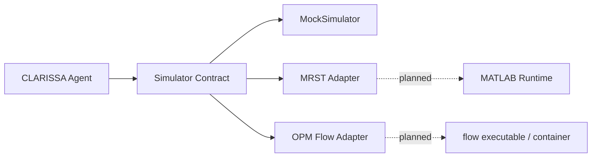
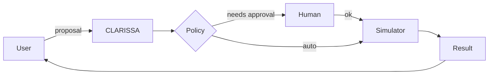
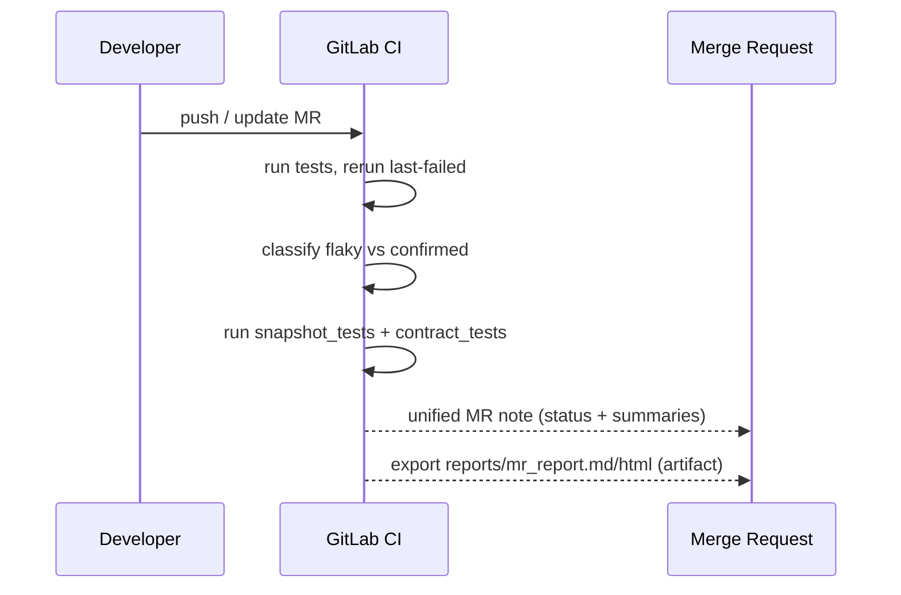
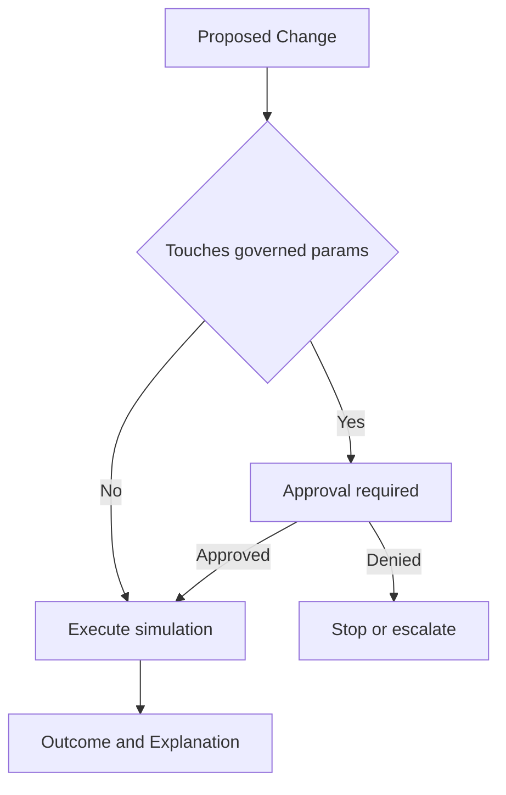

# Architecture Diagrams

Mermaid sources live in `docs/architecture/diagrams/*.mmd`.

## Diagrams

### Adapter Layer

### Agent Flow

### CI to MR Flow

### Governance Gate

---

!!! info "Source files"
    The `.mmd` sources in `diagrams/` are the canonical truth.
    Edit those files to update diagrams.
