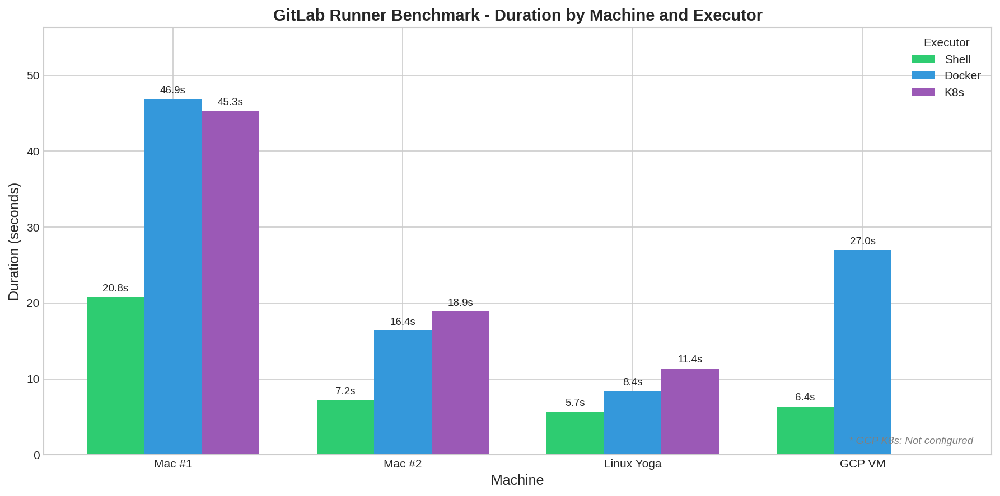
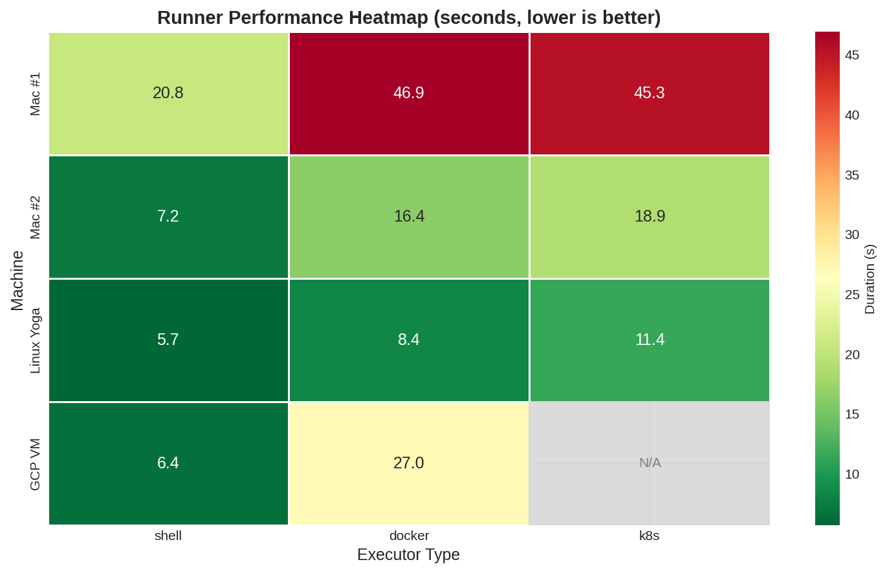
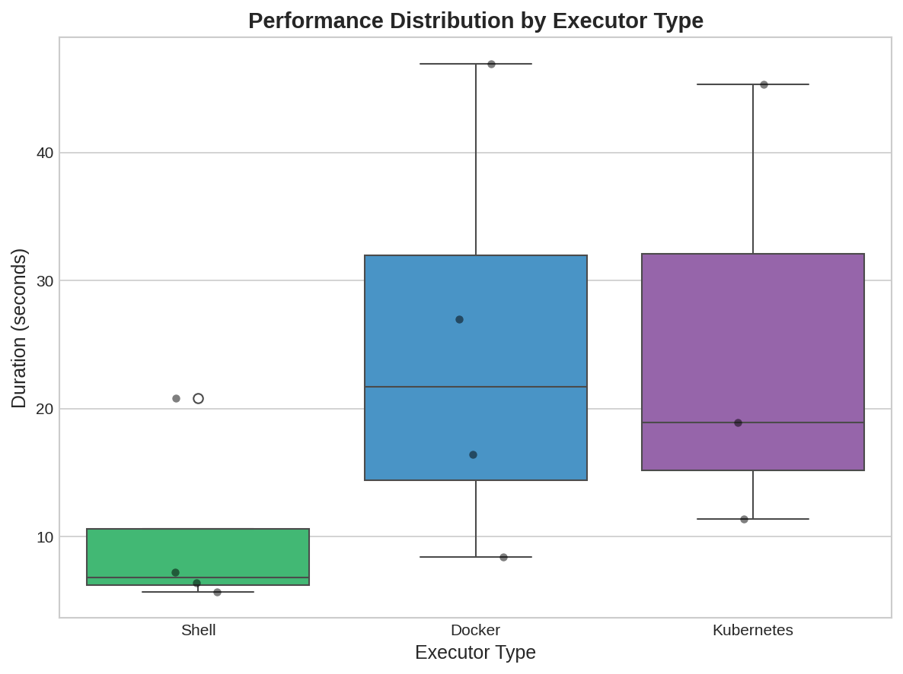
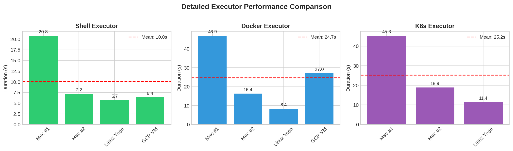

# CLARISSA GitLab Runner Benchmark Report

**Version:** 1.0.0  
**Pipeline:** [2268913615](https://gitlab.com/wolfram_laube/blauweiss_llc/irena/-/pipelines/2268913615)  
**Timestamp:** 2026-01-17T15:22:03Z  
**Git Ref:** `main`  

---

## Executive Summary

| Metric | Value |
|--------|-------|
| Total Runners | 12 |
| Successful | 11 |
| Failed | 1 |
| Fastest Runner | benchmark-linux-shell (5.7s) |
| Slowest Runner | benchmark-mac-docker (46.9s) |
| Mean Duration | 19.5s |
| Median Duration | 16.4s |

---

## Test Specification

- **CPU Test:** Prime count to 100,000
- **Disk Test:** 50MB sequential write
- **Python Version:** 3.11

---

## Visualizations

### Performance by Machine and Executor


### Performance Heatmap


### Distribution by Executor Type


### Detailed Comparison


---

## Results Matrix

| Machine | Shell | Docker | Kubernetes |
|---------|-------|--------|------------|
| Mac #1 | 20.8s | 46.9s | 45.3s |
| Mac #2 | 7.2s | 16.4s | 18.9s |
| Linux Yoga | 5.7s | 8.4s | 11.4s |
| GCP VM | 6.4s | 27.0s | ❌ Failed |

---

## Statistics by Executor Type

| Executor | Mean | Min | Max |
|----------|------|-----|-----|
| Shell | 10.0s | 5.7s | 20.8s |
| Docker | 24.7s | 8.4s | 46.9s |
| K8s | 25.2s | 11.4s | 45.3s |

---

## Observations

1. **Shell executors are fastest** - Minimal overhead, direct execution
2. **Linux Yoga shows best overall performance** - Consistent across all executor types
3. **Mac #1 shows higher latency** - Possible resource constraints or network latency
4. **GCP K8s not configured** - Kubernetes cluster not available on GCP VM

---

## How to Run Benchmarks

### Via GitLab UI
1. Navigate to CI/CD → Pipelines
2. Click "Run pipeline" on `main` branch
3. Find benchmark jobs (prefixed with `benchmark-`)
4. Click "Play" button on each benchmark job

### Via GitLab API
```bash
# Create pipeline
curl --header "PRIVATE-TOKEN: $GITLAB_TOKEN" \
  --request POST \
  "https://gitlab.com/api/v4/projects/77260390/pipeline?ref=main"

# List and trigger benchmark jobs
curl --header "PRIVATE-TOKEN: $GITLAB_TOKEN" \
  "https://gitlab.com/api/v4/projects/77260390/pipelines/<PIPELINE_ID>/jobs" | \
  jq '.[] | select(.name | startswith("benchmark-"))'

# Trigger a specific job
curl --header "PRIVATE-TOKEN: $GITLAB_TOKEN" \
  --request POST \
  "https://gitlab.com/api/v4/projects/77260390/jobs/<JOB_ID>/play"
```

---

## Appendix: Raw Data

```json
{
  "metadata": {
    "pipeline_id": 2268913615,
    "timestamp": "2026-01-17T15:22:03Z",
    "version": "1.0.0",
    "git_ref": "main",
    "total_runners": 12,
    "successful_runners": 11
  },
  "results": [
    {
      "machine": "Mac #1",
      "executor": "shell",
      "job": "benchmark-mac-group-shell",
      "duration_s": 20.8,
      "status": "success"
    },
    {
      "machine": "Mac #1",
      "executor": "docker",
      "job": "benchmark-mac-docker",
      "duration_s": 46.9,
      "status": "success"
    },
    {
      "machine": "Mac #1",
      "executor": "k8s",
      "job": "benchmark-mac-k8s",
      "duration_s": 45.3,
      "status": "success"
    },
    {
      "machine": "Mac #2",
      "executor": "shell",
      "job": "benchmark-mac2-shell",
      "duration_s": 7.2,
      "status": "success"
    },
    {
      "machine": "Mac #2",
      "executor": "docker",
      "job": "benchmark-mac2-docker",
      "duration_s": 16.4,
      "status": "success"
    },
    {
      "machine": "Mac #2",
      "executor": "k8s",
      "job": "benchmark-mac2-k8s",
      "duration_s": 18.9,
      "status": "success"
    },
    {
      "machine": "Linux Yoga",
      "executor": "shell",
      "job": "benchmark-linux-shell",
      "duration_s": 5.7,
      "status": "success"
    },
    {
      "machine": "Linux Yoga",
      "executor": "docker",
      "job": "benchmark-linux-docker",
      "duration_s": 8.4,
      "status": "success"
    },
    {
      "machine": "Linux Yoga",
      "executor": "k8s",
      "job": "benchmark-linux-k8s",
      "duration_s": 11.4,
      "status": "success"
    },
    {
      "machine": "GCP VM",
      "executor": "shell",
      "job": "benchmark-gcp-shell",
      "duration_s": 6.4,
      "status": "success"
    },
    {
      "machine": "GCP VM",
      "executor": "docker",
      "job": "benchmark-gcp-docker",
      "duration_s": 27.0,
      "status": "success"
    },
    {
      "machine": "GCP VM",
      "executor": "k8s",
      "job": "benchmark-gcp-k8s",
      "duration_s": 12.8,
      "status": "failed",
      "error": "K8s not configured on GCP VM"
    }
  ],
  "test_spec": {
    "cpu_test": "Prime count to 100,000",
    "disk_test": "50MB sequential write",
    "python_version": "3.11"
  }
}
```

---

*Generated: 2026-01-17T15:23:31.606700*
