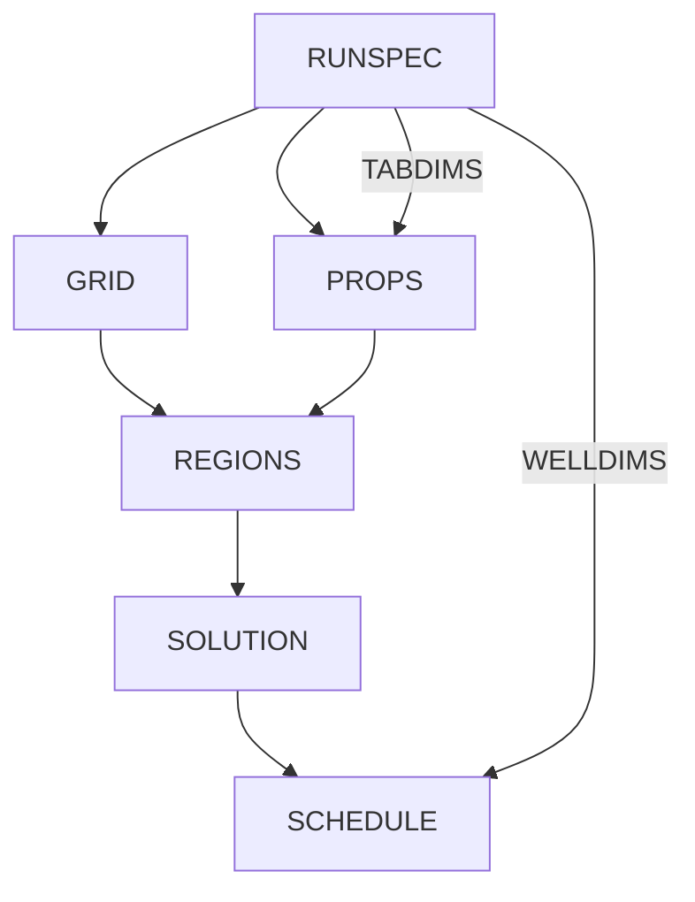

# ECLIPSE Deck Structure

This document describes the structure of ECLIPSE reservoir simulation input decks,
essential knowledge for CLARISSA's syntax generation and validation stages.

## Overview

An ECLIPSE deck is a text file (typically `.DATA` extension) organized into sections,
each containing keywords with associated data records.

```
┌─────────────────────────────────────────────────────────────┐
│                     ECLIPSE Deck                            │
├─────────────────────────────────────────────────────────────┤
│  RUNSPEC     │ Run specifications, grid dimensions, phases │
│  GRID        │ Grid geometry, properties                   │
│  EDIT        │ Grid modifications (optional)               │
│  PROPS       │ Rock and fluid properties                   │
│  REGIONS     │ Region definitions                          │
│  SOLUTION    │ Initial conditions, equilibration           │
│  SUMMARY     │ Output requests                             │
│  SCHEDULE    │ Time-dependent operations                   │
└─────────────────────────────────────────────────────────────┘
```

## Section Hierarchy

### RUNSPEC (Required)

Defines simulation type and model dimensions.

```
RUNSPEC

TITLE
My Reservoir Model

DIMENS
-- NX   NY   NZ
   100  100  20 /

-- Phase specification
OIL
WATER
GAS
DISGAS   -- Dissolved gas in oil

-- Units (default: METRIC)
FIELD    -- Use field units

-- Table dimensions
TABDIMS
-- NTSFUN NTPVT NSSFUN NPPVT NTFIP NRPVT
   1      1     50     50    1     50    /

WELLDIMS
-- NWMAX NCMAX NGMAX NWGMAX
   50    20    10    20      /

START
1 JAN 2025 /
```

**Key Keywords:**
| Keyword | Purpose | Required |
|---------|---------|----------|
| DIMENS | Grid dimensions NX, NY, NZ | ✅ |
| OIL/WATER/GAS | Active phases | ✅ (at least one) |
| TABDIMS | Table size allocations | ⚠️ Recommended |
| WELLDIMS | Well array dimensions | ⚠️ If wells present |
| START | Simulation start date | ✅ |

### GRID (Required)

Defines grid geometry and static properties.

```
GRID

-- Include external file
INCLUDE
'GRID.GRDECL' /

-- Or define inline
DX
100*100 /    -- 100 cells, each 100 ft

DY
100*100 /

DZ
20*50 /

TOPS
100*8000 /   -- Top depth of layer 1

PERMX
100*500 /    -- mD

PERMY
100*500 /

PERMZ
100*50 /     -- Usually lower vertical perm

PORO
100*0.25 /
```

**Grid Definition Options:**
| Method | Keywords | Use Case |
|--------|----------|----------|
| Cartesian | DX, DY, DZ, TOPS | Regular grids |
| Corner-point | COORD, ZCORN | Complex geometry |
| Radial | INRAD, DRV, DTHETAV | Near-wellbore |

### PROPS (Required)

Fluid and rock properties.

```
PROPS

-- PVT Properties
PVTO
-- Rs    P      Bo      Visc
-- Mscf/STB psi  rb/stb  cp
   0.001  14.7  1.062   1.04
   0.0905 264.7 1.15    0.975
   0.180  514.7 1.207   0.91  /

-- Bubble point row (no undersaturation data follows)
   0.371 1014.7 1.295   0.83  /
   0.636 2014.7 1.435   0.695 /
/

PVTW
-- Pref   Bw    Cw       Visc   Viscosibility
   4000   1.01  3.0E-6   0.3    0 /

ROCK
-- Pref   Compressibility
   4000   4.0E-6 /

DENSITY
-- Oil    Water   Gas
   49.1   64.79   0.06054 /

-- Relative Permeability
SWOF
-- Sw     Krw    Krow   Pcow
   0.2    0      1      0
   0.3    0.01   0.6    0
   0.5    0.1    0.3    0
   0.8    0.5    0.05   0
   1.0    1      0      0 /
```

### REGIONS

Defines property regions.

```
REGIONS

SATNUM
-- Saturation function region
100*1 /

PVTNUM
-- PVT region
100*1 /

FIPNUM
-- Fluid in place region
50*1 50*2 /
```

### SOLUTION (Required)

Initial conditions.

```
SOLUTION

-- Equilibration
EQUIL
-- Datum  Pressure  WOC    Pcow  GOC    Pcog  RSVD  RVVD  N
   8500   4000      9000   0     8000   0     1     1     0 /

-- Initial Rs vs depth (optional)
RSVD
   8000  0.5
   9000  0.5 /

-- Or explicit initialization
-- PRESSURE
-- 100*4000 /
-- SWAT
-- 100*0.2 /
```

### SUMMARY

Output requests.

```
SUMMARY

-- Field totals
FOPR       -- Oil production rate
FWPR       -- Water production rate
FGPR       -- Gas production rate
FOPT       -- Cumulative oil
FPR        -- Average pressure

-- Well data
WOPR
'PROD1' 'PROD2' /

WBHP
'PROD1' 'PROD2' /

-- Block data
BPR
10 10 5 /   -- Pressure at cell (10,10,5)

-- Run control
RUNSUM     -- Print summary to PRT file
EXCEL      -- Excel-compatible output
```

### SCHEDULE (Required for simulation)

Time-dependent operations.

```
SCHEDULE

-- Well specifications
WELSPECS
-- Name  Group  I   J   RefDepth  Phase
   PROD1 G1     50  50  8500      OIL /
   INJ1  G1     10  10  8500      WAT /
/

-- Completions
COMPDAT
-- Well   I  J  K1 K2 Open Sat  Diam  Kh   Skin Dir
   PROD1  50 50 1  10 OPEN 2*   0.5   1*   0    Z /
   INJ1   10 10 1  5  OPEN 2*   0.5   1*   0    Z /
/

-- Production control
WCONPROD
-- Well  Open  Ctrl  Orat  Wrat  Grat  Lrat  Resv  BHP
   PROD1 OPEN  ORAT  1000  1*    1*    1*    1*    1500 /
/

-- Injection control
WCONINJE
-- Well  Type  Open  Ctrl  Rate   Resv   BHP
   INJ1  WAT   OPEN  RATE  2000   1*     5000 /
/

-- Time stepping
TSTEP
30*30 /    -- 30 timesteps of 30 days

DATES
1 JUL 2025 /
/

-- More operations...
WELOPEN
PROD1 SHUT /
/

TSTEP
365 /

END
```

## Keyword Syntax Patterns

### Pattern 1: Simple Flag

```
KEYWORD
```
Example: `OIL`, `WATER`, `GAS`, `DISGAS`

### Pattern 2: Single Record with Terminator

```
KEYWORD
data... /
```
Example:
```
DIMENS
100 100 20 /
```

### Pattern 3: Multiple Records

```
KEYWORD
record1 /
record2 /
/              -- Empty terminator ends keyword
```
Example:
```
WELSPECS
PROD1 G1 50 50 8500 OIL /
PROD2 G1 60 60 8500 OIL /
/
```

### Pattern 4: Table Data

```
KEYWORD
-- Header comment
val1 val2 val3
val4 val5 val6 /
```
Example:
```
SWOF
0.2  0    1    0
0.5  0.1  0.4  0
1.0  1    0    0 /
```

### Pattern 5: Grid Data (per-cell)

```
KEYWORD
NX*NY*NZ values... /
```
Example:
```
PORO
10000*0.25 /     -- 10000 cells all with porosity 0.25
```

### Pattern 6: Repeat Notation

```
N*value          -- Repeat value N times
3*100            -- Equivalent to: 100 100 100
1*               -- Use default value
```

## Data Types

| Type | Example | Notes |
|------|---------|-------|
| Integer | `100`, `20` | Grid dimensions, indices |
| Real | `0.25`, `1.5E-6` | Properties, rates |
| String | `'PROD1'`, `OPEN` | Names, status |
| Date | `1 JAN 2025` | Schedule dates |
| Default | `1*` | Use simulator default |

## Comments

```
-- This is a comment (two dashes)
-- Comments extend to end of line

KEYWORD  -- Inline comment
data /
```

## Common Dependencies



## See Also

- [Keyword Reference](keyword-reference.md) - Alphabetical keyword listing
- [Common Errors](common-errors.md) - Error patterns and fixes
- [OPM Flow Guide](../simulators/opm-flow.md) - Supported keywords