# 🔧 CI/CD Publication Workflow

Automated pipeline for generating CLARISSA research papers from source contributions.

!!! info "Last Updated"
    January 2026 - Reflects current pipeline architecture with LLM merge, Mermaid rendering, and GitLab Pages deployment.

---

## Overview

The publication pipeline transforms multi-author contributions into polished PDFs:

```
sources/     →   LLM Merge    →   canonical/   →   HTML   →   PDF   →   Pages
(Doug, Mike,     (Claude/GPT)     (single MD)      render     gen      deploy
 Wolfram)
```

**Two separate pipelines:**

| Conference | Source | Build | Output |
|------------|--------|-------|--------|
| **IJACSA 2026** | LaTeX (`.tex`) | `pdflatex` | `CLARISSA_Paper_IJACSA.pdf` |
| **SPE Europe 2026** | Markdown (`.md`) + Mermaid | LLM merge → HTML → PDF | `abstract-merged.pdf` |

---

## Pipeline Architecture

### SPE Europe 2026 (LLM-Powered)

```mermaid
flowchart LR
    subgraph sources["📁 sources/"]
        doug["doug/*.docx"]
        mike["mike/*.md"]
        wolfram["wolfram/*.md"]
    end
    
    subgraph merge["🤖 LLM Merge"]
        llm["Claude/GPT API"]
    end
    
    subgraph canonical["📄 canonical/"]
        md["full-paper.md"]
    end
    
    subgraph diagrams["📊 diagrams/"]
        mmd["*.mmd"]
        svg["*.svg"]
        png["*.png"]
    end
    
    subgraph outputs["📤 outputs/"]
        html["*.html"]
        pdf["*.pdf"]
    end
    
    subgraph pages["🌐 Pages"]
        pub["publications/"]
    end
    
    doug --> llm
    mike --> llm
    wolfram --> llm
    llm --> md
    md --> html
    mmd --> svg
    mmd --> png
    svg --> html
    html --> pdf
    pdf --> pub
```



### Pipeline Stages

| Stage | Job | Trigger | Image | Duration |
|-------|-----|---------|-------|----------|
| build | `llm_merge` | `sources/**` changed | `python:3.11-slim` | ~30s |
| build | `render_diagrams` | `diagrams/*.mmd` changed | `node:20-alpine` | ~45s |
| test | `build_canonical_html` | `canonical/**` changed | `python:3.11-slim` | ~15s |
| deploy | `build_canonical_pdf` | after HTML | `node:20-alpine` | ~30s |
| deploy | `pages` | main branch | `python:3.11` | ~2min |

### IJACSA 2026 (LaTeX)


---

## Directory Structure

```
conference/
├── ijacsa-2026/                      # LaTeX paper
│   ├── CLARISSA_Paper_IJACSA.tex     # Source (authoritative)
│   ├── CLARISSA_Paper_IJACSA.pdf     # Generated
│   └── figures/
│       ├── *.mermaid                 # Diagram sources
│       └── *.png                     # Rendered images
│
└── spe-europe-2026/                  # Markdown paper
    ├── sources/                      # Original contributions
    │   ├── doug/                     # DOCX from Doug
    │   ├── mike/                     # MD from Mike
    │   └── wolfram/                  # MD from Wolfram
    │
    ├── canonical/                    # Single source of truth
    │   ├── full-paper.md             # LLM-merged content
    │   └── metadata.yaml             # Authors, versions
    │
    ├── diagrams/                     # Mermaid sources
    │   ├── architecture.mmd
    │   ├── phases.mmd
    │   ├── comparison.mmd
    │   ├── techstack.mmd
    │   ├── rigor.mmd
    │   ├── conversation.mmd
    │   └── mermaid.config.json       # Rendering config
    │
    ├── outputs/                      # Generated artifacts
    │   ├── *.html
    │   └── *.pdf
    │
    ├── scripts/                      # Build scripts
    │   ├── llm_merge.py              # LLM semantic merge
    │   ├── render_diagrams.py        # Mermaid → SVG/PNG
    │   ├── build_canonical.py        # MD → HTML
    │   └── build_canonical_html.py   # HTML styling
    │
    └── ci/
        └── document-merge.gitlab-ci.yml
```

---

## How to Edit

### Edit SPE Abstract (Markdown Authors)

```bash
# 1. Edit your source file
vim conference/spe-europe-2026/sources/wolfram/abstract-wolfram.md

# 2. Commit and push
git add -A
git commit -m "docs(spe): update methodology section"
git push

# 3. Pipeline triggers llm_merge → review merged output
```

### Edit IJACSA Paper (LaTeX)

```bash
# 1. Edit LaTeX source
cd conference/ijacsa-2026
vim CLARISSA_Paper_IJACSA.tex

# 2. Build locally (optional)
pdflatex -interaction=nonstopmode CLARISSA_Paper_IJACSA.tex
pdflatex CLARISSA_Paper_IJACSA.tex  # Second pass for refs

# 3. Commit both source AND PDF
git add CLARISSA_Paper_IJACSA.tex CLARISSA_Paper_IJACSA.pdf
git commit -m "docs(paper): add evaluation results"
git push
```

### Edit Diagrams (Mermaid)

```bash
# 1. Edit .mmd file
cd conference/spe-europe-2026/diagrams
vim architecture.mmd

# 2. Preview locally (optional)
mmdc -i architecture.mmd -o architecture.png -s 2 -b white

# 3. Commit source only (CI renders)
git add architecture.mmd
git commit -m "docs(diagrams): update architecture layers"
git push
```

---

## Mermaid Rendering

### CI Configuration

The `render_diagrams` job uses:

- **Image**: `node:20-alpine` with Chromium
- **Tool**: `@mermaid-js/mermaid-cli` (mmdc)
- **Output**: SVG + PNG (2x scale)

```yaml
before_script:
  - apk add --no-cache chromium python3
  - npm install -g @mermaid-js/mermaid-cli
  - export PUPPETEER_EXECUTABLE_PATH=/usr/bin/chromium-browser
```

### Troubleshooting Rendering Issues

| Problem | Solution |
|---------|----------|
| Placeholder text instead of diagram | Check PNG generation, not just SVG |
| Fonts not rendering | Use direct PNG output (`-o file.png`), not SVG conversion |
| Layout broken | Check `mermaid.config.json` theme settings |
| Sequence diagram missing | Verify `sequenceDiagram` syntax, check for unsupported features |

**Known Issue**: SVG-to-PNG conversion via `rsvg-convert` fails on fonts. Solution: Generate PNG directly with mmdc:

```bash
# ❌ Bad: SVG then convert
mmdc -i diagram.mmd -o diagram.svg
rsvg-convert diagram.svg -o diagram.png

# ✅ Good: Direct PNG
mmdc -i diagram.mmd -o diagram.png -s 2 -b white
```

---

## GitLab Pages Deployment

### URLs

| Resource | URL |
|----------|-----|
| Documentation | `https://wolfram-laube.gitlab.io/blauweiss-llc/irena/` |
| Publications Index | `https://wolfram-laube.gitlab.io/blauweiss-llc/irena/publications/` |
| IJACSA PDF | `.../publications/ijacsa-2026/CLARISSA_Paper_IJACSA.pdf` |
| SPE PDF | `.../publications/spe-europe-2026/abstract-merged.pdf` |

### Pages Job

The `pages` job:

1. Builds MkDocs site → `public/`
2. Copies publication PDFs to `public/publications/`
3. Creates index HTML for reviewer access
4. Deploys to GitLab Pages

```yaml
pages:
  needs:
    - job: build_paper
      optional: true
    - job: build_canonical_pdf
      optional: true
  script:
    - mkdocs build --site-dir public
    - mkdir -p public/publications/{ijacsa-2026,spe-europe-2026}
    - cp conference/ijacsa-2026/*.pdf public/publications/ijacsa-2026/
    - cp conference/spe-europe-2026/outputs/*.pdf public/publications/spe-europe-2026/
```

---

## LLM Merge Process

### How It Works

1. **Normalize**: Convert DOCX → MD via Pandoc
2. **Compare**: LLM analyzes semantic differences
3. **Merge**: LLM produces unified document
4. **Review**: Human approves merged output

### Merge Script

```python
# conference/spe-europe-2026/scripts/llm_merge.py
MERGE_PROMPT = """
You have:
1. BASE VERSION (canonical)
2. CONTRIBUTOR CHANGES (Doug, Mike, Wolfram)

Tasks:
- Identify additions, modifications, removals
- Merge semantically (not just text diff)
- Prefer detailed content over vague
- Flag true conflicts for human review
"""
```

### API Keys Required

Set in GitLab CI/CD Variables:

- `ANTHROPIC_API_KEY` - for Claude
- `OPENAI_API_KEY` - for GPT (fallback)

---

## Monitoring Pipelines

### Check Status

```bash
# Via GitLab API
curl -s --header "PRIVATE-TOKEN: $PAT" \
  "https://gitlab.com/api/v4/projects/77260390/pipelines?per_page=5"

# Or use GitLab UI
# https://gitlab.com/wolfram-laube/blauweiss-llc/irena/-/pipelines
```

### Common Issues

| Symptom | Cause | Fix |
|---------|-------|-----|
| Pipeline not triggered | Wrong path in `changes:` rule | Check file path matches rule |
| PDF missing diagrams | `render_diagrams` failed | Check mmdc/Chromium logs |
| Pages 404 | Artifacts not copied | Verify `needs:` job dependencies |
| LLM merge error | API key missing | Set `ANTHROPIC_API_KEY` in CI variables |

### Artifact Retention

- Build artifacts: **4 weeks**
- Pages deployment: **persistent** (until next deploy)

---

## Quick Reference

### Commit Message Convention

```
docs(paper): <what changed>      # LaTeX changes
docs(spe): <what changed>        # SPE abstract changes
docs(diagrams): <what changed>   # Mermaid diagram changes
```

### File Changes → Jobs Triggered

| Changed File | Jobs Triggered |
|-------------|----------------|
| `sources/**/*` | `llm_merge` |
| `canonical/**/*` | `render_diagrams` → `build_canonical_html` → `build_canonical_pdf` |
| `diagrams/*.mmd` | `render_diagrams` → `build_canonical_html` → `build_canonical_pdf` |
| `ijacsa-2026/**/*` | `build_paper` |
| Any on `main` | `pages` |

---

## Related Documentation

- [ADR-014: LLM Document Merge](../adr/ADR-014-llm-document-merge.md) - Architecture decision
- [Paper Workflow (Legacy)](paper-workflow.md) - Old LaTeX-only workflow
- [Publications Index](index.md) - Download links

---

## Changelog

| Date | Change |
|------|--------|
| 2026-01 | Added Mermaid direct PNG rendering (fixes font issues) |
| 2026-01 | Pages job now copies PDFs to publications directory |
| 2025-12 | Initial LLM merge pipeline implementation |
