# CLARISSA Tutorial: Reservoir Simulation Basics

This tutorial demonstrates how CLARISSA translates natural language into simulation decks.

## 1. Darcy's Law - The Foundation

The fundamental equation governing fluid flow in porous media is **Darcy's Law**:

$$
q = -\frac{kA}{\mu} \frac{\Delta P}{L}
$$

Where:

- $q$ = volumetric flow rate (m³/s)
- $k$ = permeability (m²)
- $A$ = cross-sectional area (m²)
- $\mu$ = dynamic viscosity (Pa·s)
- $\Delta P$ = pressure difference (Pa)
- $L$ = length of the flow path (m)

In field units, this becomes:

$$
q = \frac{1.127 \cdot k \cdot A \cdot \Delta P}{\mu \cdot L}
$$

## 2. System Architecture

```mermaid
flowchart LR
    subgraph UI["User Interface"]
        Voice["🎤 Voice"]
        Chat["💬 Chat"]
        API["🔌 API"]
    end
    
    subgraph Core["CLARISSA Core"]
        NLP["NL Parser"]
        LLM["LLM Layer"]
        Val["Validator"]
    end
    
    subgraph Sim["Simulation"]
        Gen["Deck Generator"]
        OPM["OPM Flow"]
    end
    
    Voice --> NLP
    Chat --> NLP
    API --> NLP
    NLP --> LLM
    LLM --> Val
    Val --> Gen
    Gen --> OPM
```



## 3. Python Example: Calculating Pore Volume

The pore volume calculation demonstrates basic reservoir arithmetic:

!!! tip "Interactive Code"
    Run this example in the [companion notebook](reservoir-basics-code.ipynb).

```python
# Reservoir parameters (SPE9 model)
nx, ny, nz = 24, 25, 15  # Grid dimensions
dx, dy, dz = 300, 300, 50  # Cell sizes in feet
porosity = 0.087  # Average porosity
ntg = 1.0  # Net-to-gross ratio

# Calculate volumes
bulk_volume = nx * ny * nz * dx * dy * dz  # ft³
pore_volume = bulk_volume * porosity * ntg
pore_volume_bbl = pore_volume / 5.615  # Convert to barrels

print(f"Pore volume: {pore_volume_bbl/1e6:.2f} MMbbl")
# Output: Pore volume: 6.28 MMbbl
```

## 4. ECLIPSE Deck Generation

CLARISSA generates valid ECLIPSE keywords from natural language:

```text
-- Generated by CLARISSA from: "5-spot pattern, 40 acre spacing"
RUNSPEC
TITLE
  5-Spot Waterflood - 40 Acre Spacing

DIMENS
  21 21 10 /

OIL
WATER

METRIC

WELLDIMS
  5 50 5 5 /
```

## 5. Material Balance Equation

The general material balance equation for an oil reservoir:

$$
N_p \left[ B_o + (R_p - R_s) B_g \right] = N \left[ (B_o - B_{oi}) + (R_{si} - R_s) B_g \right] + N B_{oi} \frac{c_f + c_w S_{wc}}{1 - S_{wc}} \Delta P + W_e - W_p B_w
$$

For an undersaturated reservoir above bubble point, this simplifies to:

$$
N_p B_o = N B_{oi} c_e \Delta P + W_e - W_p B_w
$$

Where the effective compressibility $c_e$ is:

$$
c_e = \frac{c_o S_o + c_w S_w + c_f}{1 - S_{wc}}
$$

---

## Next Steps

- [Getting Started Guide](../getting-started-en.md)
- [ECLIPSE Keyword Reference](../eclipse/keyword-reference.md)
- [OPM Flow Integration](../simulators/opm-flow.md)
