# Architecture Diagrams

Visual representations of CLARISSA's architecture.

## Agent Flow

How a user request flows through the system:

## Adapter Layer

How simulators are abstracted:

```mermaid
flowchart LR
    subgraph Adapters
        Mock[MockSimulator]
        OPM[OPM Flow]
        MRST[MRST]
    end
    
    subgraph Contract
        Run["run(deck) → dict"]
        Conv[converged: bool]
        Err[errors: list]
    end
    
    Agent[CLARISSA Agent] --> Contract
    Contract --> Adapters
```

## Governance Gate

The approval workflow:

## CI Pipeline

The observability-focused CI model:

## Source Files

Mermaid sources are in `docs/architecture/diagrams/`:

- `agent_flow.mmd`
- `adapter_layer.mmd`
- `governance_gate.mmd`
- `ci_to_mr.mmd`

CI renders these to SVG when possible.
