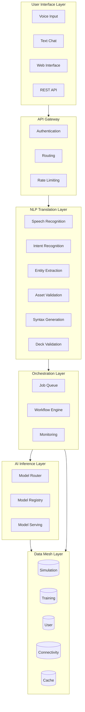
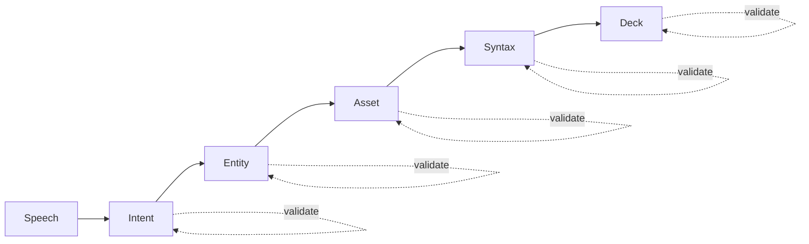

# Architecture Overview

CLARISSA's architecture comprises six primary layers, each addressing distinct concerns while maintaining loose coupling through well-defined interfaces.

## System Layers

## Core Principles

### 1. Configuration over Convention

Every major component supports runtime configuration:

- Database backends (Cassandra, MongoDB, PostgreSQL, Neo4j, Redis)
- Message brokers (Kafka, RabbitMQ, Redis Streams)
- Model serving (Ray Serve, Triton, custom)
- Authentication providers

### 2. Domain-Driven Decomposition

Service boundaries align with domain concepts:

| Domain | Responsibility | Storage |
|--------|---------------|---------|
| Simulation | Decks, results, time-series | Cassandra |
| Training | ML datasets, model artifacts | MongoDB |
| User | Auth, audit, preferences | PostgreSQL |
| Connectivity | Well relationships, flow paths | Neo4j |
| Cache | Sessions, hot data | Redis |

### 3. Event-Driven Integration

Asynchronous messaging decouples services:

- Long-running simulations don't block UI
- Progress updates via event streams
- Eventual consistency across domains

## NLP Translation Pipeline

The translation layer converts natural language to valid ECLIPSE syntax through six validated stages:

Each stage has explicit validation. Failed validation triggers rollback, not silent errors.

See [ADR-009](adr/ADR-009-nlp-translation-pipeline.md) for details.

## Deployment Scenarios

### Air-Gapped

- Locally-hosted open-source models
- Self-contained infrastructure
- Offline update via secure media

### Cloud-Native

- Managed Kubernetes
- Managed databases
- Auto-scaling

**Same code, different configuration.**

## Related ADRs

- [ADR-001: Physics-Centric Architecture](adr/ADR-001-physics-centric.md)
- [ADR-002: Separation of Roles](adr/ADR-002-separation-of-roles.md)
- [ADR-003: Native Kernel](adr/ADR-003-native-kernel.md)
- [ADR-009: NLP Pipeline](adr/ADR-009-nlp-translation-pipeline.md)
